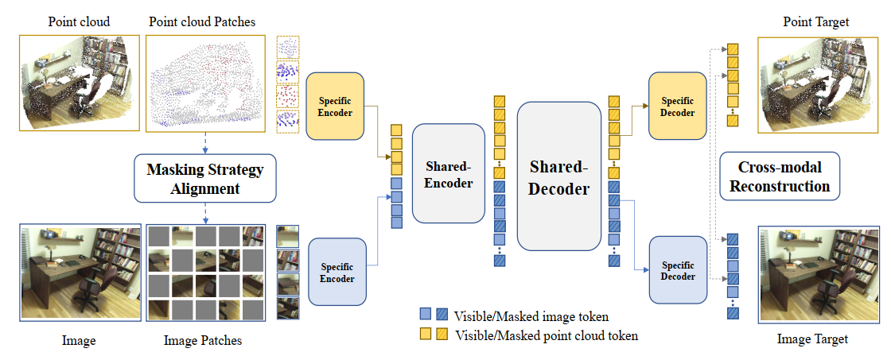
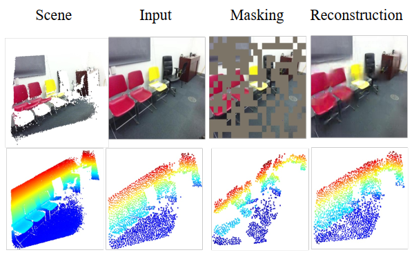

# PiMAE: Point cloud and Image Interactive Masked Autoencoders for 3D Object Detecion

Accepted to CVPR2023. 🔥

[`Paper`](https://arxiv.org/abs/2303.08129) 
| [`BibTeX`](#citation)
| [`Webpage`](https://antonioo-c.github.io/projects/pimae.html)


Pytorch pretraining & downstream-training code for <strong>PiMAE</strong>. We propose a MAE-based self-supervised pre-training framework that promotes 3D and 2D interaction to improve model performance on downstream object detection tasks.




<br>

> 📣 check out another lattest work from us, [I2P-MAE](https://github.com/ZrrSkywalker/I2P-MAE), which obtains superior 3D representations from 2D pre-trained models via Image-to-Point Masked Autoencoders. 📣 

## Model Zoo
We provide our pretrained weights (on SUNRGBD) and finetuned transformer-based baseline models (on SUNRGBD, ScanNetV2, KITTI), including 3DETR, DETR, MonoDETR.

<table>
  <thead>
    <tr style="text-align: right;">
      <th></th>
      <th>task</th>
      <th>name</th>
      <th>Dataset</th>
      <th>AP(gain)</th>
      <th>download</th>
    </tr>
  </thead>
  <tbody>
    <tr>
      <th>0</th>
      <th>Pretrain</th>
      <td>PiMAE</td>
      <td>SUNRGBD</td>
      <td><center>-</center></td>
      <td><a href="https://drive.google.com/file/d/1sJWa_j71zA1-XELE8J5fhl__bKYplbCs/view?usp=sharing">model</a>&nbsp;|&nbsp;
    </tr>
    <tr>
      <th>1</th>
      <th>3D Object Detection</th>
      <td>3DETR</td>
      <td>SUNRGBD</td>
      <td>[AP25] 59.4<span style="color:green">(+1.4)</span></td>
      <td><a href="https://drive.google.com/file/d/10jW3OYZvUBtdftUFWpZoosGrXdx5auGI/view?usp=sharing">model</a>&nbsp;|&nbsp;<a href="https://drive.google.com/file/d/1uwrPseuQ6EFknd9p7d1HnkO55yoNgHcf/view?usp=sharing">logs</a></td>
    </tr>
    <tr>
      <th>2</th>
      <th>3D Object Detection</th>
      <td>3DETR</td>
      <td>ScanNetV2</td>
      <td>[AP25] 62.6<span style="color:green">(+0.5)</span></td>
      <td><a href="https://drive.google.com/file/d/1IQCK3SA3E88hARUZ2Fju36Hxs069NcA2/view?usp=sharing">model</a>&nbsp;|&nbsp;<a href="https://drive.google.com/file/d/1h69soQsHuGzSyM0CIzlCmOBD5Sb1TNWD/view?usp=sharing">logs</a></td>
    </tr>
    <tr>
      <th>5</th>
      <th>Monocular 3D Object Detection</th>
      <td>MonoDETR</td>
      <td>KITTI</td>
      <td>[Easy] 26.6<span style="color:green">(+3.5)</span></td>
      <td><a href="https://drive.google.com/file/d/1AhZckfE0l-Ax6YEBjBycZ6DivwYnT53H/view?usp=sharing">model</a>&nbsp;|&nbsp;<a href="https://drive.google.com/file/d/1ndqRq0mcELh4nrZ4BQEr4MhS9zMz13nm/view?usp=sharing">logs</a></td>
    </tr>
    <tr>
      <th>6</th>
      <th>2D Object Detection</th>
      <td>DETR</td>
      <td>ScanNetV2</td>
      <td>[AP50] 46.5<span style="color:green">(+6.7)</span></td>
      <td><a href="https://drive.google.com/file/d/1D1aKsdewnTciJ9DLBhzT79aOzXzvguEe/view?usp=share_link">model</a>&nbsp;|&nbsp;<a href="https://drive.google.com/file/d/1V1j6fzJTDcXFU3BIlOz5vNwfHDfpY4zL/view?usp=share_link">logs</a></td>
    </tr>
  </tbody>
</table>

<br>

## Easy-Usage

We have provided a easy tutorial to use PiMAE's pre-trained 3D extractor. You can easily modify the code to fit in your model. 

Get our pretrained models from [here](https://drive.google.com/file/d/1sJWa_j71zA1-XELE8J5fhl__bKYplbCs/view?usp=sharing) and place it as <code>./Pretrain/pimae.pth</code>.

Install minimum required dependencies then simply run the tutorial code by: 
```
pip install torch torchvision

python Pretrain/tutorial_load.py
```

## Pretraining

### Install
First, clone this repository into your local machine.
```
git clone https://github.com/BLVLab/PiMAE.git
```
Next, install required dependencies.
```
cd Pretrain

sh install.sh
```

### Data Preparation
We follow the [VoteNet](https://github.com/facebookresearch/votenet) to preprocess our data. The instructions for preparing SUN RGB-D are [here](https://github.com/facebookresearch/votenet/tree/main/sunrgbd).
Remember to Edit the dataset paths in <code>Pretrain/datasets/sunrgbd.py</code>.

### Training

```
python main.py --config cfgs/pretrain_JD_pc2img.yaml --exp_name pimae
```

### Visualization
To get reconstruction visualization like this.



```
python main_vis.py \
	--test \
	--ckpts ./experiments/pretrain/cfgs/pimae/ckpt-last.pth \
	--config ./experiments/pretrain/cfgs/pimae/config.yaml \
	--exp_name vis_pimae \
```

## Downstream

### 3DETR
Follow [3DETR](https://github.com/facebookresearch/3detr) codebase to prepare the training data (SUNRGBD & ScanNetV2).

Install required dependencies by
```
cd Downstream/3detr

sh install.sh
```
Run the training code (you can specify training configure in the script)
```
sh run.sh
```

### MonoDETR
Follow [MonoDETR](https://github.com/ZrrSkywalker/MonoDETR) codebase to prepare the training data (KITTI).
Install required dependencies by
```
cd Downstream/MonoDETR

sh install.sh
```
Run the code for training and testing (remember to check <code>monodetr.yaml</code> where we specify path to pimae weights).
```
bash train.sh configs/monodetr.yaml > logs/monodetr.log # training

bash test.sh configs/monodetr.yaml # testing
```

### DETR
Follow [DETR](Downstream/detr/README.md) to prepare data and required dependencies. Then train it by 

```
cd Downstream/detr/d2

python train_net.py --config configs/detr_256_6_6_torchvision.yaml --num-gpus 8
```

### Acknowledgement

This repository is based on [3DETR](https://github.com/facebookresearch/3detr), [MonoDETR](https://github.com/ZrrSkywalker/MonoDETR), [DETR](https://github.com/facebookresearch/detr), [timm](https://github.com/rwightman/pytorch-image-models/tree/master/timm), [MAE](https://github.com/facebookresearch/mae) repositories, we thank them for their great work.

### Citation

If you find this repository helpful, please consider citing our work:

```
@inproceedings{chen2023pimae，
  title={PiMAE: Point Cloud and Image Interactive Masked Autoencoders for 3D Object Detection},
  author = {Chen, Anthony and Zhang, Kevin and Zhang, Renrui and Wang, Zihan and Lu, Yuheng and Guo, Yandong and Zhang, Shanghang},
  booktitle={Proceedings of the IEEE/CVF Conference on Computer Vision and Pattern Recognition},
  year={2023}
}
```
